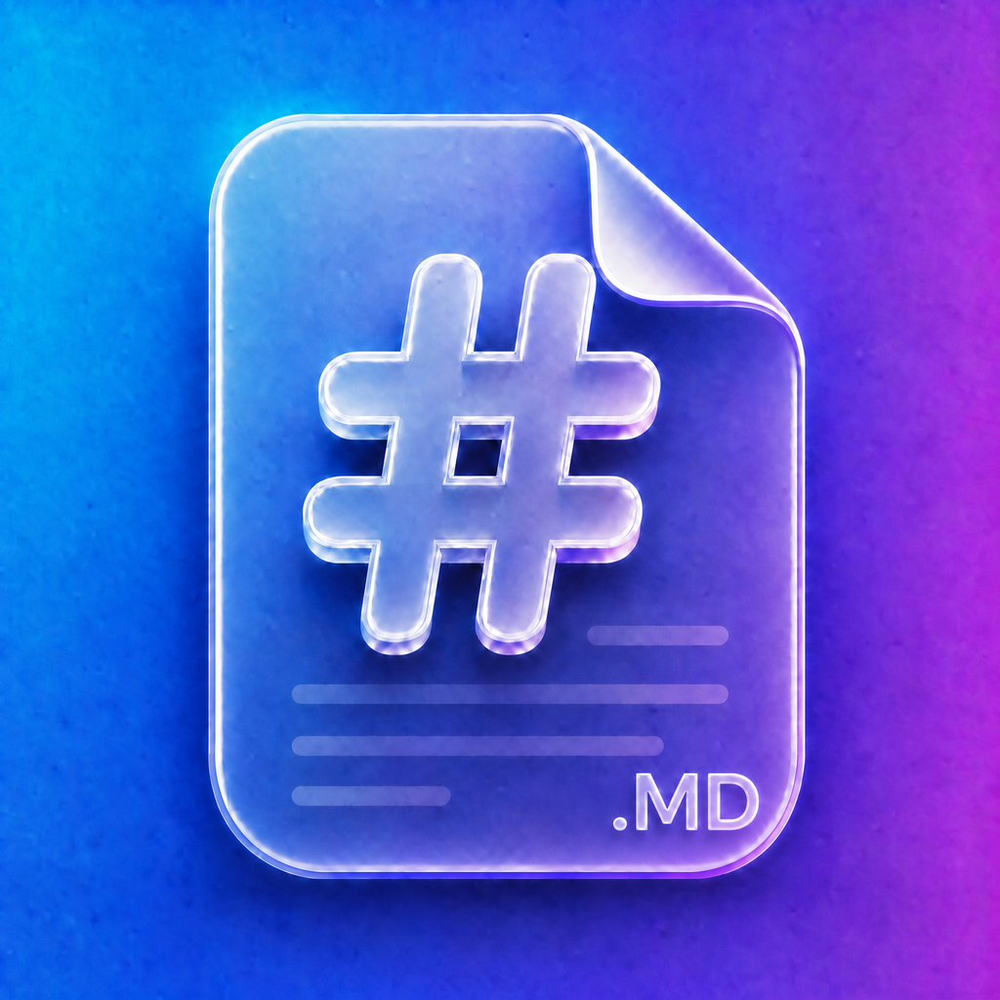

<p align="center">
  
</p>

<h1 align="center">Hashmark</h1>

<p align="center">
  一款面向 iPhone 与 iPad 的原生 Markdown 阅读、编辑与 AI 写作 App。
</p>

<p align="center">
  
  
  
  
</p>

Hashmark 希望把 Markdown 写作留在一个轻量、安静且真正适合触屏的原生环境里：文档由用户自己管理，预览资源可离线工作，AI 则是按需启用的辅助能力，而不是使用 App 的前置条件。

> 当前项目仍在积极开发中，仓库暂未提供 App Store 下载链接。

## 功能概览

### 文档管理

- 在 App 内新建 Markdown 文档与任意层级文件夹。
- 按最近活动排序，支持重命名、移动和删除。
- 使用可折叠目录树在文档之间快速切换。
- 从系统“文件”App 选择文档，或通过其他 App 的“打开方式”进入只读预览。
- 导入前先确认目标目录，也可以在目录选择器中直接新建文件夹。
- 文档保存在 App 的 `Documents` 目录，并可通过系统“文件”App 访问。

### Markdown 预览

- GitHub 风格排版与 GFM 支持。
- 代码块语法高亮。
- KaTeX 数学公式渲染。
- Mermaid 图表渲染，以及缩放、拖动和全屏查看。
- 浅色、深色主题实时适配。
- 外部链接使用独立的 Safari 页面打开，不打断当前文档。
- `marked`、highlight.js、KaTeX 与 Mermaid 均随 App 本地打包，普通预览无需联网。

### 原生编辑体验

- 基于 `UITextView` 封装的原生编辑器，保留完整的纯文本 Markdown 源码。
- 非破坏性 Markdown 语法着色。
- 键盘快捷栏支持标题、粗体、斜体、删除线、链接、行内代码、列表、任务列表、引用、缩进和代码块。
- 智能续写列表与引用、成对符号补全、选中文字后粘贴 URL 自动生成链接。
- 文档大纲导航；在预览与编辑状态间支持横向手势切换。
- iPad 宽屏编辑时并排显示源码与预览，并双向同步滚动位置。
- 离开编辑页或切换至预览时自动保存。

### 分享与导出

- 整篇长截图。
- PDF。
- 去除 Markdown 标记后的纯文本。
- 原始 `.md` 文件。
- Markdown 源内容。

### 可选 AI 写作

Hashmark 采用 BYOK（Bring Your Own Key）方式连接用户选择的 AI 服务。目前内置以下 Provider 的原生协议适配：

- OpenAI
- Anthropic
- Google Gemini
- Moonshot Kimi
- Zhipu GLM

可用能力包括从零生成、续写、润色、整理 Markdown 格式、选区润色、流式预览、继续精修与重新生成。自由写作场景下，模型还可以在需求不明确时发起结构化澄清。

在 Provider 和模型声明支持时，还可使用推理过程展示、原生联网搜索，以及图片、相机照片、PDF、外部文本文件或 Hashmark 内文档作为参考附件。实际能力以所选 Provider、模型及用户配置为准。

## 界面与适配

- 支持 iPhone 与 iPad，最低系统版本为 iOS / iPadOS 18。
- 支持跟随系统、浅色和深色三种外观偏好。
- iOS 26 及以上使用系统 Liquid Glass；iOS 18–25 自动降级为系统材质效果。
- 支持动态字体、VoiceOver 语义标签和系统 SF Symbols。
- 支持跟随系统语言，或在 App 内切换简体中文、繁体中文、English、日本語、한국어、Deutsch、Русский。

## 隐私与数据

- Markdown 文档默认保存在 App 沙盒的 `Documents` 目录。
- 主题和语言偏好保存在本机；AI 接口地址、模型与 API Key 保存在本机的 `Application Support` 目录。
- Markdown 预览在本机完成，不会为了渲染正文而上传文档。
- AI 功能默认不需要配置。只有在用户主动发起 AI 请求时，相关提示词、文档上下文及用户选择的附件才会发送至所配置的 Provider；数据处理同时受对应 Provider 的隐私条款约束。
- Hashmark 当前不通过自有中转服务代理 AI 请求，App 会直接连接用户配置的接口地址。

## 技术栈

| 领域 | 实现 |
| --- | --- |
| App UI | SwiftUI，必要处桥接 UIKit |
| 编辑器 | `UITextView` + 独立 Markdown 编辑命令引擎 |
| 预览 | `WKWebView` + 本地 HTML / CSS / JavaScript |
| Markdown | marked + GitHub Markdown CSS |
| 扩展渲染 | highlight.js、KaTeX、Mermaid |
| 数据存储 | FileManager、UserDefaults、Application Support |
| AI | 五家 Provider 的原生请求、流式解析、工具与附件适配 |
| 依赖管理 | 无 Swift Package Manager 第三方依赖 |

Web 预览组件的版本与许可证见 [Third-Party Notices](MarkdownApp/MarkdownApp/Resources/WebPreview/THIRD_PARTY_NOTICES.md)。

## 项目结构

```text
MarkdownApp/
├── MarkdownApp.xcodeproj/
├── MarkdownApp/
│   ├── DesignSystem/     # 主题、玻璃效果、本地化与通用交互
│   ├── Features/
│   │   ├── AI/           # AI 写作会话、附件、澄清与流式展示
│   │   ├── Browser/      # 文档与目录管理
│   │   ├── Document/     # 预览 / 编辑主屏与模式协调
│   │   ├── Editor/       # 原生编辑器、命令、大纲与语法着色
│   │   ├── Import/       # 外部文件预览与导入
│   │   ├── Preview/      # Web 预览、外链与分享导出
│   │   ├── Settings/     # 外观、语言与 AI 配置
│   │   └── Switcher/     # 文档快速切换
│   ├── Models/           # 文件存储、设置、文档与 AI Provider
│   └── Resources/        # String Catalog 与离线 Web 资源
├── AIReasoningTests/     # Provider 协议与流式回归测试
├── AISettingsTests/      # AI 配置回归测试
├── FileBrowserTests/     # 文件管理回归测试
└── MarkdownEditingTests/ # Markdown 编辑引擎测试
```

## 本地运行

### 环境要求

- macOS
- Xcode 26.6 或更高版本
- iOS / iPadOS 18 或更高版本的模拟器或设备
- 真机运行时需要可用的 Apple Developer 签名团队

### 启动步骤

1. 克隆仓库：

   ```bash
   git clone https://github.com/kvsur/hashmark.git
   cd hashmark
   ```

2. 打开 Xcode 工程：

   ```bash
   open MarkdownApp/MarkdownApp.xcodeproj
   ```

3. 选择 `MarkdownApp` Scheme 和目标设备。若使用真机，请在 Signing & Capabilities 中选择自己的开发团队。

4. 点击 Run，或使用 `⌘R` 构建并启动。

项目没有需要额外安装的 Swift Package，离线预览资源已经包含在仓库中。

也可以在命令行验证模拟器构建：

```bash
xcodebuild \
  -project MarkdownApp/MarkdownApp.xcodeproj \
  -scheme MarkdownApp \
  -destination 'generic/platform=iOS Simulator' \
  CODE_SIGNING_ALLOWED=NO \
  build
```

## 测试

AI Provider、附件、搜索、流式事件与配置逻辑提供了独立回归测试：

```bash
MarkdownApp/AIReasoningTests/run-all.sh
```

模型目录差异、可选 live snapshot、能力证据与发版边界见 [AI model maintenance runbook](MarkdownApp/AIReasoningTests/AI_MODEL_MAINTENANCE_RUNBOOK.md)。

文件管理和 Markdown 编辑引擎也保留了独立测试用例，位于 `MarkdownApp/FileBrowserTests` 与 `MarkdownApp/MarkdownEditingTests`。新增功能时，请同步补充对应层的测试，并至少完成一次模拟器构建。

## 反馈

欢迎通过 [GitHub Issues](https://github.com/kvsur/hashmark/issues) 提交问题或建议，也可以发送邮件至 [hello1024lc@gmail.com](mailto:hello1024lc@gmail.com)。

## 许可证

当前仓库尚未附带开源许可证。在许可证明确之前，源代码默认保留所有权利。
